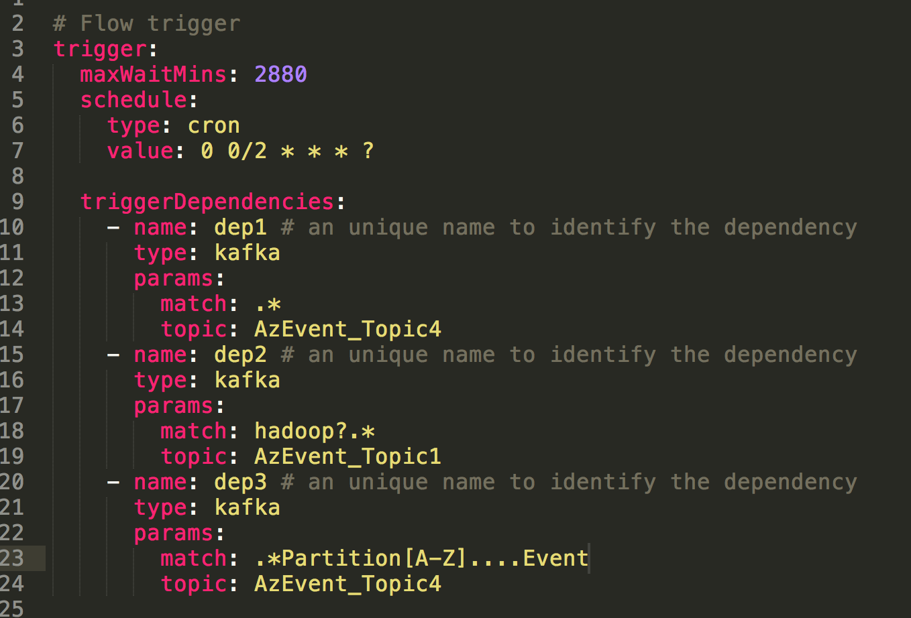

.. _EventBasedTrigger:

Flow Trigger Dependency Plugin
==================================
*****
Event Based Trigger
*****

Currently there are only few ways to launch jobs in Azkaban including schedules and API. However, they are limited because sometimes jobs need to be executed automatically on demand. Event trigger is a new feature introduced by Azkaban. It defines a new paradigm of triggering flows - triggering a flow on event arrival. This concept enables users to define events that the flow depends on. Once all of the dependencies become ready, a workflow will be triggered. 

Apache Kafka is a Publish & Subscribe data streaming system. By utilizing Kafka, we do the regular expression match on the Kafka event payload. With the contain-a logic matching, a dependency will be marked as satisfied only if the whole payload contains the Regex pattern that user predefines.

*****
Getting started with Deploying Event Trigger on the Solo Server
*****

Azkaban builds use Gradle (downloads automatically when run using gradlew which is the Gradle wrapper) and requires Java 8 or higher.

Build
########
The following commands run on *nix platforms like Linux, OS X. For building Flow Trigger Dependency Plugin, we need to run the comment in ``/az-flow-trigger-dependency-type/kafka-event-trigger`` directory. 
::
  # Build Azkaban
  ../../gradlew build

  # Clean the build
  ../../gradlew clean

  # Build without running tests
  ../../gradlew build -x test

These are all standard Gradle commands. Please look at Gradle documentation for more info.

Solo-Server Configuration
########
The gradlew commands help you to build the fat JAR. After that, you need to specify the plugin.dir within solo-server in ``conf``. Override the ``azkaban.dependency.plugin.dir`` property for runtime parameters inside the ``azkaban.properties`` file under the solo-server ``conf`` directory.
This property needs to set to contain the location where you put your Event-Trigger JAR file. 

Data Base Configuration (Optinal)
########
The following 4 properties can be defined in ``conf/azkaban.private.properties``. for solo-server based on the use case. 

+-----------------------------------------+
| Properties                              |
+=========================================+
| mysql.user                              |
+-----------------------------------------+
| mysql.password                          |     
+-----------------------------------------+
| org.quartz.dataSource.quartzDS.user     |
+-----------------------------------------+
| org.quartz.dataSource.quartzDS.password |
+-----------------------------------------+

*****
Event Based Trigger Plugin Configuration
*****

Inside the Azkaban dependency plugin directory, there should be two items Event Based Trigger plugin jar and the ``dependency.properties``. 

Required properties are :

- **dependency.classpath** - Used by Azkaban identify plugins classpath. Should be the JAR file’s absolute path.

- **dependency.class** - Used by Azkaban flow trigger instance to integrate with this configuration file. Take Event trigger for example, it should be  ``trigger.kafka.KafkaDependencyCheck``. 

- **kafka.broker.url** - Specifying URL and port number where your Kafka broker is. 

*****
Event Trigger Instance Configuration
*****
Event trigger is part of flow definition and each flow can only have one event trigger at most. 
Defining an event trigger is supported via Hadoop DSL.
The trigger need to be configurated within the flow file along with the project zip that users upload.
Event trigger is composed of a list of event dependencies, max wait time and schedule.
Take the following figure as example:

- **Max Wait Time**: How long the trigger will wait for all dependencies to be available before cancelling it.
- **Trigger.schedule**: The schedule to perform this workflow on the regular basis. We use the cron time format here to specify, creating a trigger followed by the project workflow every 2 minutes 

- **Trigger.schedule**: The params here is to clarify what regex pattern happening in the event coming from specific topic channel. The trigger kick-starts the flow if all of predefined dependency conditions are met. 

Therefore, this trigger example will launch the flow once detecting Kafka event with anything in ``AzEvent_Topic4``, ``.*Partition[A-Z]....Event`` string in event comming from ``AzEvent_Topic4`` and ``hadoop?.*`` in ``AzEvent_Topic1``.

The matching mechanism can be extended other than regex since now it is implemented as a generic interface.

*****
Event Based Trigger Example With Azkaban UI
*****

Follow these steps to run end to end local test:

1. Clone the repo:
::
  git clone https://github.com/azkaban/azkaban.git
2. Build Azkaban and create an installation package:
::
  cd azkaban; ./gradlew build installDist
3. Start the solo server: 
::
  cd azkaban-solo-server/build/install/azkaban-solo-server; bin/azkaban-solo-start.sh
Azkaban solo server should be all set, by listening to ``8081`` port at default to accept incoming network request. So, open a web browser and check out ``http://localhost:8081/``

4. Stop server:
::
  bin/azkaban-solo-shutdown.sh

*****
Limitation
*****

*****
Resource Referance
*****
- `MySQL Documentation Site <https://dev.mysql.com/doc/>`_

